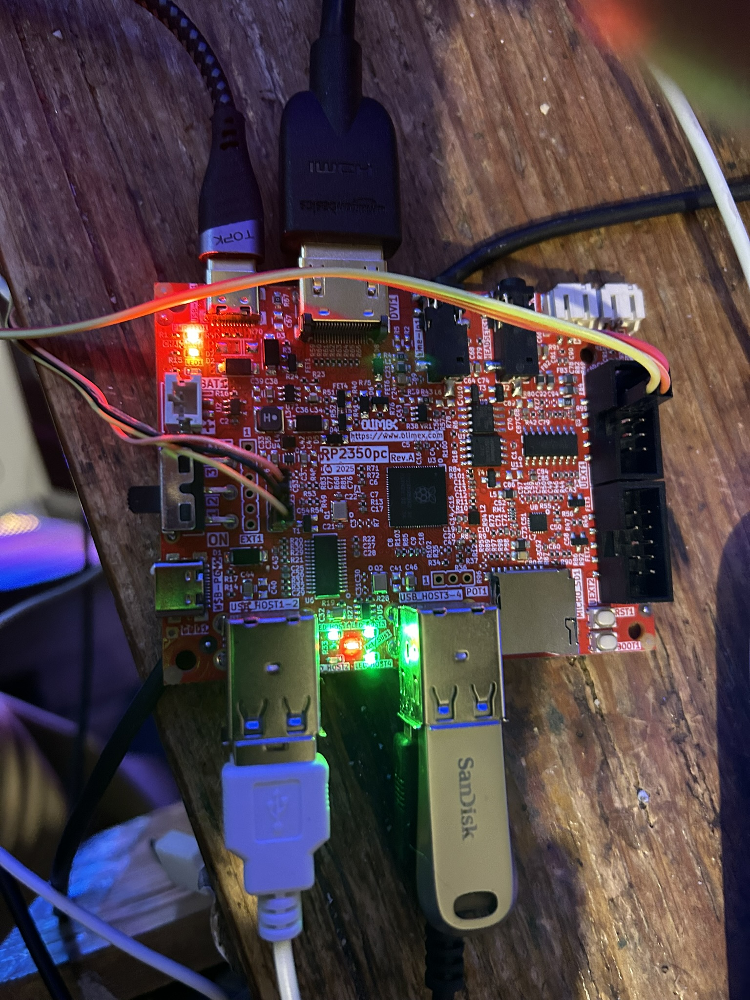

# Getting Started

The picture below shows the basic set up. There is no sound or microphone connections, and the SD Card is not currently implemented

Along the top, there is a data/power connection and a DVI/HDMI connector. 

If you want to load a file onto the board using UF2 files (boot mode) by holding boot and pressing and releasing reset, then releasing boot, you need a data connection connected into the USB-C connector on the left hand side of the board beneath the switch.

The slide switch is the main power, this position (e.g. towards the USB hubs) is on.

You can see 4 USB devices plugged into the hb, a Sandisk USB key, a keyboard, and a USB mouse. The spare slot is for a game controller. Currently only the Olimex type SNES controller is supported, though it isn't difficult to add others.

There are two groups of three wires. Neither are actually required to run any code or develop anything. On the left is the connection to a Pico based debugger, on the right the connection to the serial port.

## Power

There are 2 USB C sockets on the board, you can see these in the two images.  The one above has the USB cable plugged into the socket near the HDMI connector. This is for running and uploading via the debug pins.

The other one (the below picture) is plugged into the programming socket between the slide switch and the USB, this one is required for "Reset/Boot" uploading via UF2.

On my hardware it has to be set up as above (e.g. power near HDMI) or the USB times out on start up. 

I have changed the usage since this picture was taken ; I have magnetic data connectors that plug into the 2 USB C ports which make switching backwards and forwards much easier (and does not stress the sockets). 

## Debugging

The board is set up for debugging. There are two connectors from the 'standard debug device' (the little 1" square box). On the right, there are three connections to the USB serial port. On the left, the debug connector. 

The picture below is the same image with the connectors removed so you can see the colouring of the plugs in the connectors, my debugger is sold by "Pi Hut" in the UK, so I don't know if the colours are standard.

The RP2350PC does not come with the pins soldered in to the connector nearest the toggle switch (or my prototype didn't) so you may have to solder in 3 x 0.1" pins to make this connection.

## Setting up the Toolchain

Two things are required. One is the Pico SDK, which can be downloaded or git cloned. This should be done recursively so as to bring in the tinyusb library. (Check the note in README.md about 2.2.0, as currently PicoDVI will only compile on 2.1.1)

The other is the C compiler, which is the same as for the RP2040 for ARM code.

By default it is set up for ARM mode. 

To switch to RISCV mode edit pico.linux.make ; this involves changing the PLATFORM environment variable and setting the toolchain path below.

The RISC-V compiler is here https://embecosm.com/downloads/tool-chain-downloads/#corev and the usage is described here https://www.cnx-software.com/2024/08/31/using-risc-v-cores-on-the-raspberry-pi-pico-2-board-and-rp2350-mcu-from-blinking-an-led-to-building-linux/ , at the moment this is not directly available in distributions.

I used the Ubuntu 22.04 one which works fine on Arch Linux. I just downloaded it an extracted it somewhere.

The locations of these are in pico.linux.make and pico.macOS.make (thanks to Giovanni who wrote and tested this) in the environment directory. 

If anyone can convert these for a Windows install it would be much appreciated.

## Tutorial

There is now a tutorial 'draw circle' which takes you slowly through uploading, building existing programs, and creating a new program which ... draws a circle. It is in drawcircle.md

## Using the ToolChain

There is a 3 file build in 'experimental', blinky, which blinks the green LED on the board. This is probably the best way to check it is working. 

It is fairly easy to put the board into upload mode ; move the USB connector to the one next to the slide switch, and put your finger on the outermost of the two buttons (Boot) and rock on and off the reset button.

OpenOcd is also required if you are going to upload via the debugger rather than rebooting and file copying which is okay occasionally but a bit annoying to do all the time.  This is the one downloadable from the raspberry pi site which has been customised. 

If you are uploading from the debugger you have to have previously booted it using a UF2 and the file system using the core processor you want to use - so to switch from ARM to RISCV you have to upload a RISCV built UF2 manually - you can't simply change, recompile and upload over debugger, it will crash.

There are provided UF2s for 'blinky' - this just flashes the green LED for ever in the other/prebuilt directory, for both ARM and RISCV.

## Code

This is a brief description on how the module/runtime system works. There is a fuller description of this in modules.md and a walkthrough on drawcircle.md.

## Modules and Applications

The code is not a big lump like previously, it is divided into hierarchical modules and applications.

Each module has a simple demo (except common) in app/main.c which shows the various functionalities. An application is the same thing, just there is more code in it.

These are designed to do the bare minimum to abstract the hardware ; the user can use as much or as little as they want. Plans include for example a function to provide standard modes (the DVI module just does enough to generate video), and graphics functions on top of that, and so on.

Each module is built using cmake. There is a Makefile which has several options 

- make cmake : this rebuilds the Make structure so you can actually build it
- make compile : this compiles the code
- make upload : this uploads it to the board using openocd
- make serial : this starts the serial TTY program picocom to see what's coming off the board, there are many options for this.
- make all : does compile upload serial to run a program

There is nothing for PSRAM, the Codec chip, or PWM audio yet because I haven't looked at it.

### Runtime

The runtime, which is under development, is a PC/SDL based version of the low level modules (e.g. common, dvi and usb) so that programs can be developed without having to upload all the time. It's not an emulator (it's not speed limited, and some things won't work), but it's quite good for fast testing.

------

Paul Robson

10 August 2025