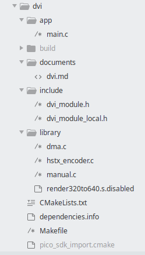

# Modules

Modules are either libraries, or applications, or both. The application can either be something in of itself or it can be a test for the library. 

Modules are a standalone entity that can be built using cmake (this can be done with the provided Makefile), or can be included in other modules.

Modules outside the lowest level are abstracted from the Pico API. It is perfectly possible to use the API in any program that uses a module, but it isn't required. Such a program would not run on the runtime version of course.

## Current Modules

These are the current modules. In the runtime the functionality of the low level modules is partly handled by the runtime itself, to provide a functionally equivalent interface at a mid-level.

|  Module  | Low  | Purpose                                                      |      |
| :------: | ---- | ------------------------------------------------------------ | ---- |
|  Common  | Yes  | Provides some common hardware functions and logging facilities. |      |
|   DVI    | Yes  | Lowest level possible DVI interface, horizontal line drivers. |      |
|   USB    | Yes  | Provides low level HID device interface (e.g. USB packets) and a simple File system. |      |
|  PSRAM   | Yes  | This is the physical hardware interface to the PSRAM Chip    |      |
|  Input   |      | HID Manager. Converts the Keyboard HID data to a keyboard queue/tracking system in ASCII with localisation. The Gamepad HID is converted to an easy interface, with a keyboard option if no Gamepad is available. The mouse HID is converted into position and button tracking |      |
| Graphics |      | Low level graphics functions - draws rectangles, ellipses, text, lines and similar. |      |
|   Text   |      | Provides a text display module for console style input/output |      |
|  Bully   |      | This is an application which allows me to 'bully' the USB system (and other things) to see if they crash. |      |
|  Memory  |      | This manages static RAM in the Pico and PSRAM.               |      |

## Elements of Modules

This is from my Sublime Text folder tree, and it's the module for "dvi", the library which provides low level interface to the HSTX system.

### app directory

This contains application files, which can be any C file or files, but is main.c here. 

There are three things to note :

1) the main function is not called main() but is called MAINPROGRAM()
2) infinite loops are not while(true) but while (COMAppRunning())
4) routines call COMUpdate() periodically - this updates things that ... need updating, like the USB system, and the SDL 2 implementation of the runtime for development.

Some of these are related to the runtime system, which allows running of these apps on a PC. It uses SDL which is an event driven system, so it has to yield periodically to redraw the display, and infinite loops will make an app unable to close. MAINPROGRAM() exists because there is a wrapper main() in the runtime.

### build directory

This is set up by cmake for building the applications. It is grey because git ignores it.

### documents directory

This provides a blank .md file to encourage you to write markup documentation.

### include directory

There can be any number of files here, but there are always two that here are dvi_module.h and dvi_module_local.h ; the former is external linking, and the latter is for library internals, say functions, types and structures you do not wish to expose. You can access pico functions here but they must be #ifndef RUNTIME/#endif wrapped ; the runtime does not provide virtually all of the SDK functionality.

### library directory

This is the sources files for the library. It picks up source files, which is why a file is typed as 'disabled', if it wasn't it would be picked up automatically.

### others

#### CMakeLists.txt

The CMake file

#### dependencies.info

A list of other modules this module requires

#### Makefile

A makefile which simplifies building using cmake as it provides the parameters etc. from the environment subdirectory

### pico_sdk_import.cmake

A requirement

## builder.py

The alert reader will have noticed that there is a Python script "builder.py" in the module root. This creates modules (which can also be applications). 

It generates a complete skeleton which is compilable.  There is no sample application created (just a file with an empty MAINAPPLICATION) but examples exist in the modules, the console/app/main.c file is particularly straightforward.

It will **not** overwrite any existing file.

The syntax is **python [module] [module] [module] -o [directory]**

Modules dependencies are detected automatically, inserting them does no harm though. 

Currently they all have to be in the same directory which is something I must fix :)

Paul Robson 

7 August 2025